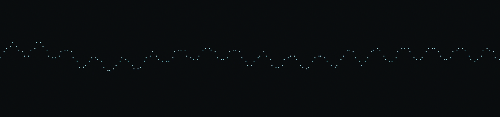
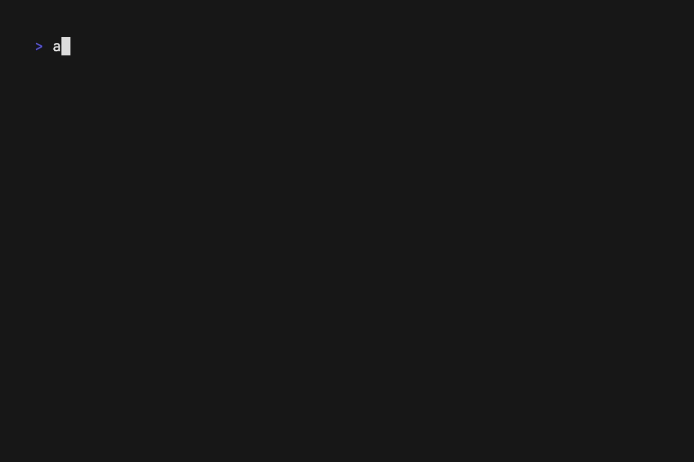

<h1 align="center"><code>aud</code></h1>

scriptable <code>aud</code>io terminal tools

🧱 Requires [Rust](https://www.rust-lang.org/tools/install) and [Just](https://github.com/casey/just)

🔨 `just install <INSTALL_DIR>`: build `aud` and install it on your system

💻 `just setup`: setup development environment for this project

🌶️ Scriptable in [Lua](https://www.lua.org/start.html), with hooks and `hot-reloading`

🎥 [Renders](./doc/renders.md) - some renders aren't 100% representative

📚 [APIs](./api/) for the scriptable commands

    
latest list of commands

    

