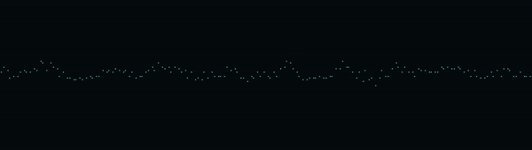

<h1 align="center"><code>aud</code></h1>

scriptable <code>aud</code>io terminal tools

🧱 `Requires`: [Rust](https://www.rust-lang.org/tools/install) and [Just](https://github.com/casey/just)

🌶️ `Scriptable`: in [Lua](https://www.lua.org/start.html), with `hooks`, `hot-reloading` and `sandboxed panics`

🔨 `Install`: `just install <INSTALL_DIR>`: build `aud` and install it on your system

💻 `Contribute`: `just setup`: setup development environment for this project

📚 `Learn`: [Docs](./doc/readme.md) for all commands

<h2 align="center"><code>usage</code></h2>

After installing, you can generate and install terminal auto-completions scripts.

<h2 align="center"><code>commands</code></h2>

### `midimon`

MIDI Monitor:
- Select a MIDI input device to open the stream
- Hit `spacebar` to pause.

### `auscope`

Audio Oscilloscope:

- Select an audio source to open the stream.
- Use the core library in Rust (or through C-FFI API) to produce sources.
- Sources can be sent over UDP.

### `derlink`

Ableton Link Client

