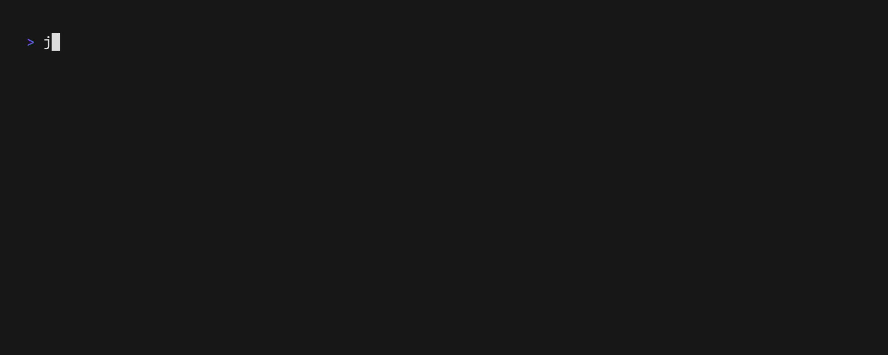

# `aud`

<b>project info</b>

Requires <a href="https://www.rust-lang.org/tools/install">Rust</a> and <a href="https://github.com/casey/just">Just</a>

    Build and install with:

    `just build install <INSTALL_DIR>`

    given <INSTALL_DIR> is in your $PATH

    most apps have a usage popup that appears by pressing: `?`

    Some renders aren't 100%... `vhs` is still cool!

## `midimon`

<b>?</b>

    MIDI Input Monitor

    Select an input port and watch the MIDI messages coming in.

## `auscope`

<b>?</b>

    Audio Oscilloscope

    Select and audio device and watch the audio signal.
    Startup option to scope inputs or outputs.

## `derlink`

<b>?</b>

    Ableton Link controller!

